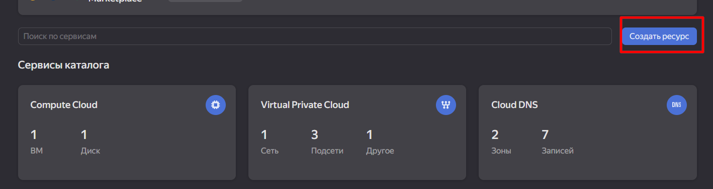
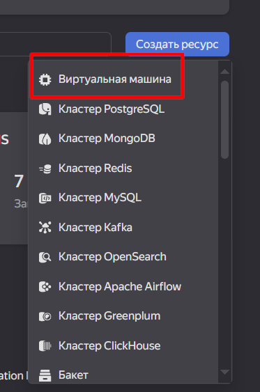
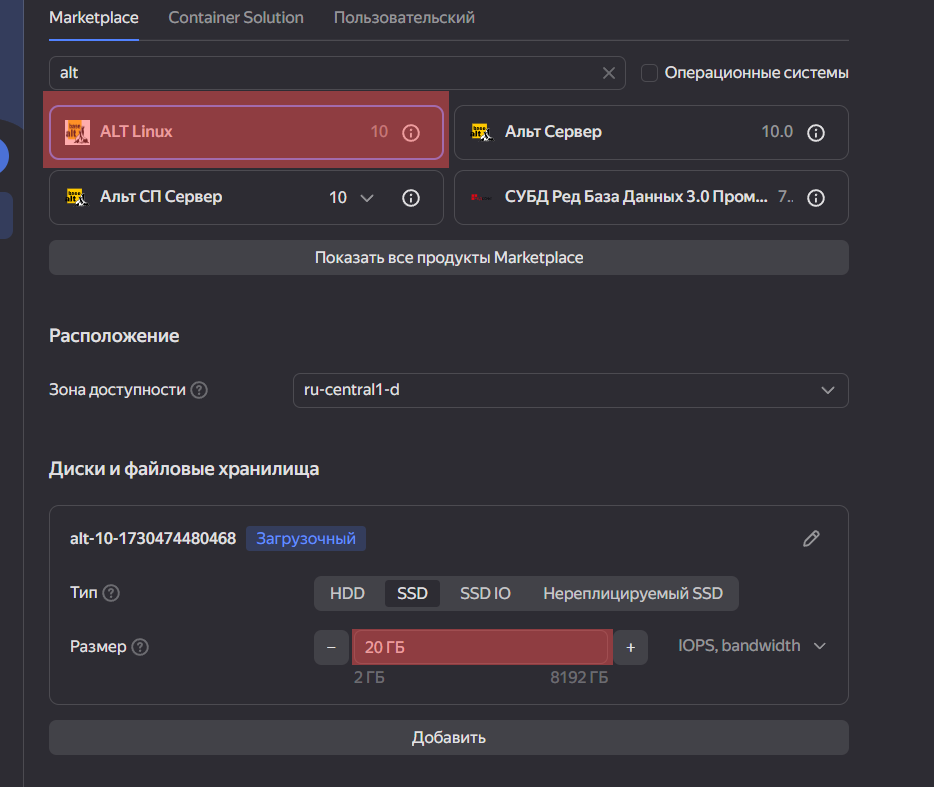
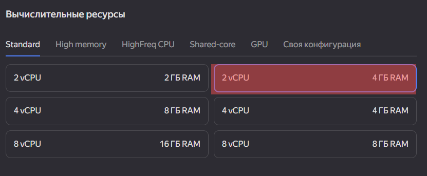
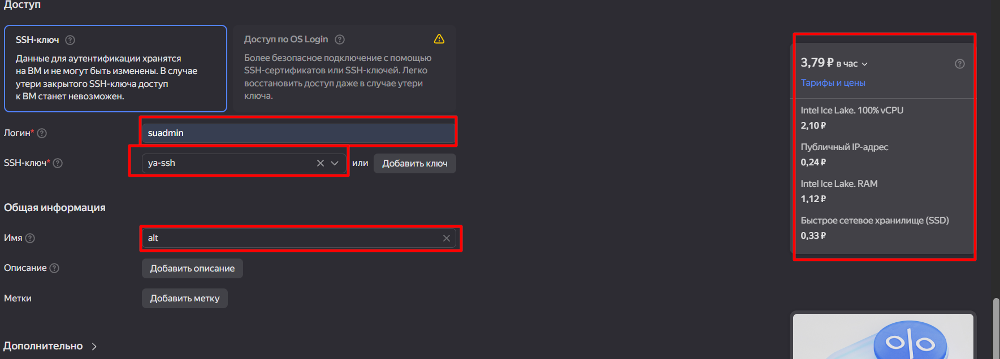
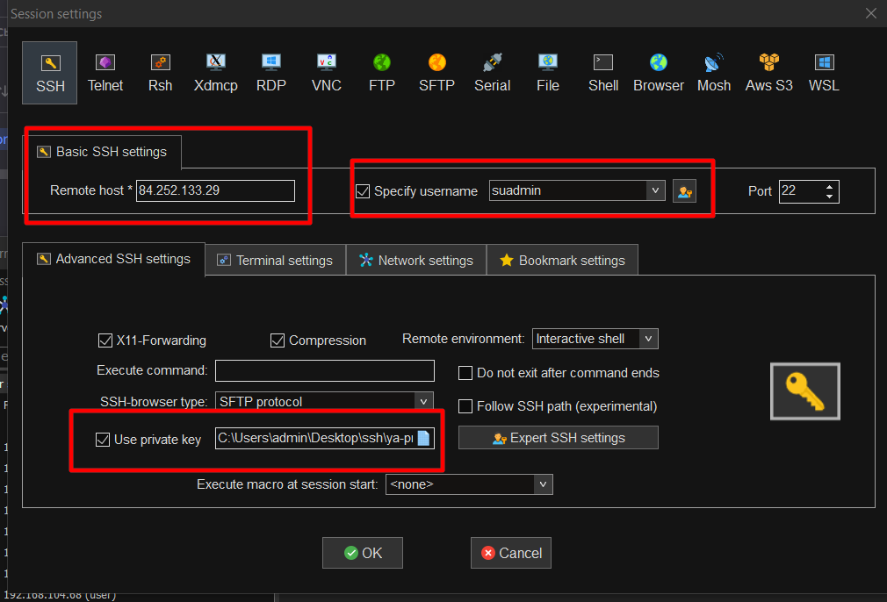
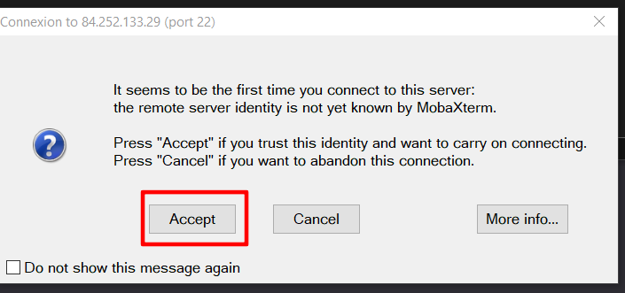

# Инструкция по установке и настройке СУБД MariaDB на ALT Linux, а также по созданию базы данных и добавлению данных.

# Шаг 0: Подготовка 







Получение прав суперпользователя:
```
sudo su
```
Переключается на пользователя root для выполнения команд с привилегиями суперпользователя.

Установка пароля для пользователя suadmin:
```
passwd suadmin
```
Устанавливает или изменяет пароль для пользователя suadmin.

Настройка привилегий для пользователей suadmin и root:
```
echo "suadmin ALL=(ALL:ALL) NOPASSWD: ALL" >> /etc/sudoers
echo "root ALL=(ALL:ALL) NOPASSWD: ALL" >> /etc/sudoers
echo "suadmin ALL=(ALL:ALL) ALL" >> /etc/sudoers
echo "root ALL=(ALL:ALL) ALL" >> /etc/sudoers
```
Добавляет в файл /etc/sudoers правила, позволяющие пользователям suadmin и root выполнять команды без запроса пароля.

Выход из режима суперпользователя:
```
exit
```
Возвращается к обычному пользователю.

# Шаг 1: Обновление системных пакетов

Обновление списка доступных пакетов:
```
sudo apt-get update
```
Обновляет индекс пакетов для получения информации о новых версиях программ.

Обновление установленных пакетов:
```
sudo apt-get upgrade --enable-upgrade -y
```
Обновляет все установленные пакеты до последних версий.

Установка сервера MariaDB:
```
sudo apt-get install mariadb-server -y
```
Устанавливает сервер баз данных MariaDB.

Запуск службы MariaDB:
```
sudo systemctl start mariadb
```
Запускает службу MariaDB для обеспечения ее работы.

Проверка статуса MariaDB:
```
sudo systemctl status mariadb
```
Показывает текущий статус службы MariaDB.

Первоначальная настройка безопасности MariaDB:
```
sudo mysql_secure_installation
```
Запускает скрипт для настройки безопасности MariaDB (установка пароля root, удаление анонимных пользователей и т.д.). Следуйте инструкциям на экране, обычно рекомендуется отвечать Y на все вопросы.

# Шаг 2: Создание базы данных и пользователя

Вход в консоль MariaDB от имени root:
```
sudo mariadb
```
Открывает консоль MariaDB с правами суперпользователя.

Создание базы данных almaz:

```
CREATE DATABASE almazdb;
```
Создает новую базу данных с именем almazdb.

Создание пользователя almaz с паролем 12345:
```
CREATE USER 'almaz'@'localhost' IDENTIFIED BY '12345';
```
Создает нового пользователя базы данных с указанными учетными данными.

Предоставление всех привилегий пользователю almaz на базу almazdb:
```
GRANT ALL PRIVILEGES ON almazdb.* TO 'almaz'@'localhost';
```
Даёт пользователю almaz полный доступ к базе данных almazdb.

Применение изменений привилегий:
```
FLUSH PRIVILEGES;
```
Обновляет привилегии, чтобы они вступили в силу немедленно.

Выход из консоли MariaDB:
```
EXIT;
```
Закрывает сеанс MariaDB.

# Шаг 3: Вход под пользователем almaz и выбор базы данных

Вход в MariaDB под пользователем almaz:
```
sudo mariadb -u almaz -p
```
Открывает консоль MariaDB от имени пользователя almaz. При запросе пароля введите 12345.

Выбор базы данных almazdb:
```
USE almazdb;
```
Переключается на базу данных almazdb для дальнейшей работы.

# Шаг 4: Создание таблиц

Создание таблицы Events:
```
CREATE TABLE Events (
    EventID INT AUTO_INCREMENT PRIMARY KEY,
    EventTime DATETIME NOT NULL,
    Source VARCHAR(100)
);
```
Таблица для хранения событий с их временем и источником.

Создание таблицы Devices:
```
CREATE TABLE Devices (
    DeviceID INT AUTO_INCREMENT PRIMARY KEY,
    IPAddress VARCHAR(45) NOT NULL,
    SubnetMask VARCHAR(45),
    MACAddress VARCHAR(17),
    Gateway VARCHAR(45)
);
```
Таблица для хранения информации об устройствах сети.

Создание таблицы EventHistory:
```
CREATE TABLE EventHistory (
    HistoryID INT AUTO_INCREMENT PRIMARY KEY,
    EventID INT,
    Description TEXT,
    TimeSpent INT, -- в секундах
    RequestSent TEXT,
    TrafficSize INT, -- в байтах
    FOREIGN KEY (EventID) REFERENCES Events(EventID)
);
```
Таблица для хранения истории событий, связанная с таблицей Events через EventID.

Создание таблицы Permissions:
```
CREATE TABLE Permissions (
    PermissionID INT AUTO_INCREMENT PRIMARY KEY,
    Type ENUM('Allowed', 'Blocked') NOT NULL,
    Item VARCHAR(255) NOT NULL
);
```
Таблица для хранения разрешений с указанием типа и элемента.

# Шаг 5: Вставка данных в таблицы

Вставка данных в таблицу Events:
```
INSERT INTO Events (EventTime, Source) VALUES
('2023-10-01 10:00:00', 'Router1'),
('2023-10-01 10:05:00', 'Router2'),
('2023-10-01 10:10:00', 'Router1'),
('2023-10-01 10:15:00', 'Router3'),
('2023-10-01 10:20:00', 'Router2'),
('2023-10-01 10:25:00', 'Router1'),
('2023-10-01 10:30:00', 'Router3'),
('2023-10-01 10:35:00', 'Router2'),
('2023-10-01 10:40:00', 'Router1'),
('2023-10-01 10:45:00', 'Router3');
```
Добавляет записи событий с указанием времени и источника.

Вставка данных в таблицу Devices:
```
INSERT INTO Devices (IPAddress, SubnetMask, MACAddress, Gateway) VALUES
('192.168.1.2', '255.255.255.0', 'AA:BB:CC:DD:EE:01', '192.168.1.1'),
('192.168.1.3', '255.255.255.0', 'AA:BB:CC:DD:EE:02', '192.168.1.1'),
('192.168.1.4', '255.255.255.0', 'AA:BB:CC:DD:EE:03', '192.168.1.1'),
('192.168.1.5', '255.255.255.0', 'AA:BB:CC:DD:EE:04', '192.168.1.1'),
('192.168.1.6', '255.255.255.0', 'AA:BB:CC:DD:EE:05', '192.168.1.1'),
('192.168.1.7', '255.255.255.0', 'AA:BB:CC:DD:EE:06', '192.168.1.1'),
('192.168.1.8', '255.255.255.0', 'AA:BB:CC:DD:EE:07', '192.168.1.1'),
('192.168.1.9', '255.255.255.0', 'AA:BB:CC:DD:EE:08', '192.168.1.1'),
('192.168.1.10', '255.255.255.0', 'AA:BB:CC:DD:EE:09', '192.168.1.1'),
('192.168.1.11', '255.255.255.0', 'AA:BB:CC:DD:EE:0A', '192.168.1.1');
```
Добавляет записи об устройствах с их IP-адресами и другими деталями.

Вставка данных в таблицу EventHistory:
```
INSERT INTO EventHistory (EventID, Description, TimeSpent, RequestSent, TrafficSize) VALUES
(1, 'Получен IP через DHCP, открытие браузера, посещение example.com', 300, 'GET / HTTP/1.1', 2048),
(2, 'Получен IP через DHCP, открытие браузера, посещение test.com', 200, 'GET /home HTTP/1.1', 1024),
(3, 'Получен IP через DHCP, открытие браузера, посещение sample.com', 400, 'GET /index HTTP/1.1', 3072),
(4, 'Получен IP через DHCP, открытие браузера, посещение site.com', 150, 'GET /about HTTP/1.1', 512),
(5, 'Получен IP через DHCP, открытие браузера, посещение website.com', 250, 'GET /contact HTTP/1.1', 1536),
(6, 'Получен IP через DHCP, открытие браузера, посещение page.com', 350, 'GET /services HTTP/1.1', 2560),
(7, 'Получен IP через DHCP, открытие браузера, посещение portal.com', 450, 'GET /login HTTP/1.1', 3584),
(8, 'Получен IP через DHCP, открытие браузера, посещение domain.com', 100, 'GET /signup HTTP/1.1', 768),
(9, 'Получен IP через DHCP, открытие браузера, посещение network.com', 500, 'GET /dashboard HTTP/1.1', 4096),
(10, 'Получен IP через DHCP, открытие браузера, посещение web.com', 600, 'GET /profile HTTP/1.1', 4608);
```
Добавляет записи истории событий, связывая их с соответствующими событиями.

Вставка данных в таблицу Permissions:
```
INSERT INTO Permissions (Type, Item) VALUES
('Allowed', 'example.com'),
('Blocked', 'blockedsite.com'),
('Allowed', 'test.com'),
('Blocked', 'malicious.com'),
('Allowed', 'sample.com'),
('Blocked', 'phishing.com'),
('Allowed', 'site.com'),
('Blocked', 'spam.com'),
('Allowed', 'website.com'),
('Blocked', 'dangerous.com');
```
Добавляет записи о разрешенных и заблокированных элементах.

# Шаг 6: Выполнение различных запросов к базе данных

Получение всех событий с их историей:
```
SELECT e.EventID, e.EventTime, e.Source, h.Description, h.TimeSpent, h.RequestSent, h.TrafficSize
FROM Events e
JOIN EventHistory h ON e.EventID = h.EventID;
```
Результат:
```
+---------+---------------------+---------+-----------------------------------------------------------+-----------+-------------------------+-------------+
| EventID | EventTime           | Source  | Description                                               | TimeSpent | RequestSent             | TrafficSize |
+---------+---------------------+---------+-----------------------------------------------------------+-----------+-------------------------+-------------+
|       1 | 2023-10-01 10:00:00 | Router1 | Obtained IP via DHCP, opened browser, visited example.com |       300 | GET / HTTP/1.1          |        2048 |
|       2 | 2023-10-01 10:05:00 | Router2 | Obtained IP via DHCP, opened browser, visited test.com    |       200 | GET /home HTTP/1.1      |        1024 |
|       3 | 2023-10-01 10:10:00 | Router1 | Obtained IP via DHCP, opened browser, visited sample.com  |       400 | GET /index HTTP/1.1     |        3072 |
|       4 | 2023-10-01 10:15:00 | Router3 | Obtained IP via DHCP, opened browser, visited site.com    |       150 | GET /about HTTP/1.1     |         512 |
|       5 | 2023-10-01 10:20:00 | Router2 | Obtained IP via DHCP, opened browser, visited website.com |       250 | GET /contact HTTP/1.1   |        1536 |
|       6 | 2023-10-01 10:25:00 | Router1 | Obtained IP via DHCP, opened browser, visited page.com    |       350 | GET /services HTTP/1.1  |        2560 |
|       7 | 2023-10-01 10:30:00 | Router3 | Obtained IP via DHCP, opened browser, visited portal.com  |       450 | GET /login HTTP/1.1     |        3584 |
|       8 | 2023-10-01 10:35:00 | Router2 | Obtained IP via DHCP, opened browser, visited domain.com  |       100 | GET /signup HTTP/1.1    |         768 |
|       9 | 2023-10-01 10:40:00 | Router1 | Obtained IP via DHCP, opened browser, visited network.com |       500 | GET /dashboard HTTP/1.1 |        4096 |
|      10 | 2023-10-01 10:45:00 | Router3 | Obtained IP via DHCP, opened browser, visited web.com     |       600 | GET /profile HTTP/1.1   |        4608 |
+---------+---------------------+---------+-----------------------------------------------------------+-----------+-------------------------+-------------+
```
Объединяет таблицы Events и EventHistory для отображения полной информации о каждом событии.

Список всех устройств и их деталей:
```
SELECT * FROM Devices;
```
Результат:
```
+----------+--------------+---------------+-------------------+-------------+
| DeviceID | IPAddress    | SubnetMask    | MACAddress        | Gateway     |
+----------+--------------+---------------+-------------------+-------------+
|        1 | 192.168.1.2  | 255.255.255.0 | AA:BB:CC:DD:EE:01 | 192.168.1.1 |
|        2 | 192.168.1.3  | 255.255.255.0 | AA:BB:CC:DD:EE:02 | 192.168.1.1 |
|        3 | 192.168.1.4  | 255.255.255.0 | AA:BB:CC:DD:EE:03 | 192.168.1.1 |
|        4 | 192.168.1.5  | 255.255.255.0 | AA:BB:CC:DD:EE:04 | 192.168.1.1 |
|        5 | 192.168.1.6  | 255.255.255.0 | AA:BB:CC:DD:EE:05 | 192.168.1.1 |
|        6 | 192.168.1.7  | 255.255.255.0 | AA:BB:CC:DD:EE:06 | 192.168.1.1 |
|        7 | 192.168.1.8  | 255.255.255.0 | AA:BB:CC:DD:EE:07 | 192.168.1.1 |
|        8 | 192.168.1.9  | 255.255.255.0 | AA:BB:CC:DD:EE:08 | 192.168.1.1 |
|        9 | 192.168.1.10 | 255.255.255.0 | AA:BB:CC:DD:EE:09 | 192.168.1.1 |
|       10 | 192.168.1.11 | 255.255.255.0 | AA:BB:CC:DD:EE:0A | 192.168.1.1 |
+----------+--------------+---------------+-------------------+-------------+
```

Показывает все устройства, зарегистрированные в системе.

Получение событий из источника 'Router1':

```
SELECT * FROM Events
WHERE Source = 'Router1';
```
Результат:
```
+---------+---------------------+---------+
| EventID | EventTime           | Source  |
+---------+---------------------+---------+
|       1 | 2023-10-01 10:00:00 | Router1 |
|       3 | 2023-10-01 10:10:00 | Router1 |
|       6 | 2023-10-01 10:25:00 | Router1 |
|       9 | 2023-10-01 10:40:00 | Router1 |
+---------+---------------------+---------+
```
Выбирает все события, связанные с Router1.

Нахождение всех заблокированных элементов:

```
SELECT * FROM Permissions
WHERE Type = 'Blocked';
```
Результат:
```
+--------------+---------+-----------------+
| PermissionID | Type    | Item            |
+--------------+---------+-----------------+
|            2 | Blocked | blockedsite.com |
|            4 | Blocked | malicious.com   |
|            6 | Blocked | phishing.com    |
|            8 | Blocked | spam.com        |
|           10 | Blocked | dangerous.com   |
+--------------+---------+-----------------+
```

Показывает все элементы, которые были помечены как заблокированные.

Вычисление общего размера трафика для каждого события:
```
SELECT EventID, SUM(TrafficSize) AS TotalTraffic
FROM EventHistory
GROUP BY EventID;
```
Результат:
```
+---------+--------------+
| EventID | TotalTraffic |
+---------+--------------+
|       1 |         2048 |
|       2 |         1024 |
|       3 |         3072 |
|       4 |          512 |
|       5 |         1536 |
|       6 |         2560 |
|       7 |         3584 |
|       8 |          768 |
|       9 |         4096 |
|      10 |         4608 |
+---------+--------------+
```
Суммирует объем трафика для каждого события.

Получение событий с временем более 5 минут:
```
SELECT e.EventID, e.EventTime, e.Source, h.TimeSpent
FROM Events e
JOIN EventHistory h ON e.EventID = h.EventID
WHERE h.TimeSpent > 300;
```
Результат:
```
+---------+---------------------+---------+-----------+
| EventID | EventTime           | Source  | TimeSpent |
+---------+---------------------+---------+-----------+
|       3 | 2023-10-01 10:10:00 | Router1 |       400 |
|       6 | 2023-10-01 10:25:00 | Router1 |       350 |
|       7 | 2023-10-01 10:30:00 | Router3 |       450 |
|       9 | 2023-10-01 10:40:00 | Router1 |       500 |
|      10 | 2023-10-01 10:45:00 | Router3 |       600 |
+---------+---------------------+---------+-----------+
```
Выбирает события, на которые затрачено более 300 секунд.

Список устройств с IP-адресами от '192.168.1.5' до '192.168.1.9':
```
SELECT * FROM Devices
WHERE IPAddress BETWEEN '192.168.1.5' AND '192.168.1.9';
```
Результат:
```
+----------+-------------+---------------+-------------------+-------------+
| DeviceID | IPAddress   | SubnetMask    | MACAddress        | Gateway     |
+----------+-------------+---------------+-------------------+-------------+
|        4 | 192.168.1.5 | 255.255.255.0 | AA:BB:CC:DD:EE:04 | 192.168.1.1 |
|        5 | 192.168.1.6 | 255.255.255.0 | AA:BB:CC:DD:EE:05 | 192.168.1.1 |
|        6 | 192.168.1.7 | 255.255.255.0 | AA:BB:CC:DD:EE:06 | 192.168.1.1 |
|        7 | 192.168.1.8 | 255.255.255.0 | AA:BB:CC:DD:EE:07 | 192.168.1.1 |
|        8 | 192.168.1.9 | 255.255.255.0 | AA:BB:CC:DD:EE:08 | 192.168.1.1 |
+----------+-------------+---------------+-------------------+-------------+
```
Выбирает устройства в указанном диапазоне IP-адресов.

Получение историй событий, связанных с разрешенными сайтами:
```
SELECT h.*
FROM EventHistory h
JOIN Permissions p ON h.Description LIKE CONCAT('%', p.Item, '%')
WHERE p.Type = 'Allowed';
```
Результат:
```
+-----------+---------+-----------------------------------------------------------+-----------+-----------------------+-------------+
| HistoryID | EventID | Description                                               | TimeSpent | RequestSent           | TrafficSize |
+-----------+---------+-----------------------------------------------------------+-----------+-----------------------+-------------+
|         1 |       1 | Obtained IP via DHCP, opened browser, visited example.com |       300 | GET / HTTP/1.1        |        2048 |
|         2 |       2 | Obtained IP via DHCP, opened browser, visited test.com    |       200 | GET /home HTTP/1.1    |        1024 |
|         3 |       3 | Obtained IP via DHCP, opened browser, visited sample.com  |       400 | GET /index HTTP/1.1   |        3072 |
|         4 |       4 | Obtained IP via DHCP, opened browser, visited site.com    |       150 | GET /about HTTP/1.1   |         512 |
|         5 |       5 | Obtained IP via DHCP, opened browser, visited website.com |       250 | GET /contact HTTP/1.1 |        1536 |
|         5 |       5 | Obtained IP via DHCP, opened browser, visited website.com |       250 | GET /contact HTTP/1.1 |        1536 |
+-----------+---------+-----------------------------------------------------------+-----------+-----------------------+-------------+
```
Выбирает истории событий, которые содержат в описании разрешенные элементы.

Подсчет количества событий для каждого источника:
```
SELECT Source, COUNT(*) AS EventCount
FROM Events
GROUP BY Source;
```
Результат:
```
+---------+------------+
| Source  | EventCount |
+---------+------------+
| Router1 |          4 |
| Router2 |          3 |
| Router3 |          3 |
+---------+------------+
```
Показывает количество событий, произошедших на каждом источнике.

Получение последних 5 событий по времени:
```
SELECT * FROM Events
ORDER BY EventTime DESC
LIMIT 5;
```
Результат:
```
+---------+---------------------+---------+
| EventID | EventTime           | Source  |
+---------+---------------------+---------+
|      10 | 2023-10-01 10:45:00 | Router3 |
|       9 | 2023-10-01 10:40:00 | Router1 |
|       8 | 2023-10-01 10:35:00 | Router2 |
|       7 | 2023-10-01 10:30:00 | Router3 |
|       6 | 2023-10-01 10:25:00 | Router1 |
+---------+---------------------+---------+
```

Отображает последние пять событий, упорядоченных по времени.

